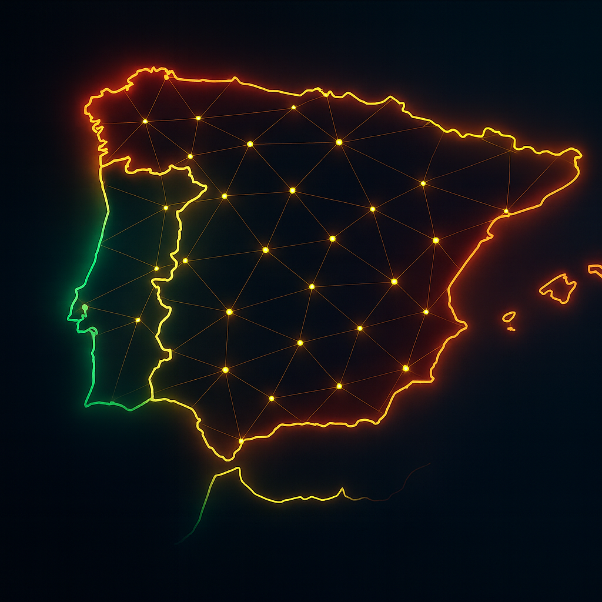

# 🌍 IberiaHub — Iberian Esports & Community Platform

<p align="center">
  
</p>

<p align="center">
  <a href="https://iberiahub.com"></a>
  
  
  
  
</p>

**IberiaHub** is the first professional platform uniting the **Portuguese and Spanish esports scene**.  
Starting with **Counter-Strike 2**, expanding to **EA FC**, **Free Fire**, and **League of Legends**.

🔗 **Live project**: <https://iberiahub.com>

---

## ✨ Why IberiaHub?
- 🌐 **Cross-border ecosystem**: Portugal ↔ Spain, one community.  
- 🧑‍🤝‍🧑 **Players meet Teams**: draft system, visibility, recruitment.  
- 📰 **Esports Media Hub**: curated news, highlights, and updates.  
- 🏟️ **Community First**: open lobbies, active players (not just rankings).  
- 📜 **Professional Framework**: legal & sponsor support for clubs.  

> IberiaHub is more than a platform — it's **the home of Iberian esports**.

---

## 🧱 Architecture (high-level)
- **Frontend** → Next.js · React · TailwindCSS  
- **Backend** → Node.js (NestJS/Express)  
- **Database** → PostgreSQL + Redis  
- **Infra** → Dockerized services on Contabo VPS (per-hub deploys)  
- **Security** → Isolated environments, GDPR-ready by design  

---

## 🚀 Current Modules
- **CS2Hub** → dedicated space for Counter-Strike 2 in Iberia.  
- **Teams & Players Profiles** → identity, needs, recruitment.  
- **News & Highlights** → showcase Iberian esports.  
- **Draft (Roadmap)** → connecting free agents with active teams.  
- **Community & Lobby (Roadmap)** → highlight who's active in real time.  

---

## 🗺️ Roadmap
- ✅ Public website online  
- 🔄 CS2Hub homepage final polish (hero, hover states, animations)  
- 🔜 **Teams** tab with live team profiles and applications  
- 🔜 **Player & Team Profiles** (`/perfil/jogador/:id`, `/perfil/equipa/:id`)  
- 🔜 Draft system (beta)  
- 🔜 Multi-language (PT · ES · EN)  
- 🔜 Sponsor & legal partner integration  

---

## 📸 Preview
<p align="center">
  
</p>

---

## 🧩 Repository Structure (public)

```
iberiahub-public/
├─ frontend/          # placeholder for public-facing assets/modules
├─ backend/           # placeholder for public-facing modules/specs
├─ docs/
│  └─ assets/         # images used by README
├─ .gitignore
├─ LICENSE
└─ README.md
```

> ⚠️ This repository is **public-facing only**. Core source code and infra remain in **private repos**.

---

## 🤝 Get Involved
We are open to collaborations with:  
- 🏆 **Esports teams & leagues**  
- 💼 **Sponsors & media partners**  
- 💻 **Contributors** (frontend, backend, design)  

📩 Contact us:  
- 🌍 Project → hello@iberiahub.com  
- 👤 Developer → hugo1297@gmail.com  

---

## ⚖️ License
**All rights reserved.**  
This repository is for presentation and community purposes only.