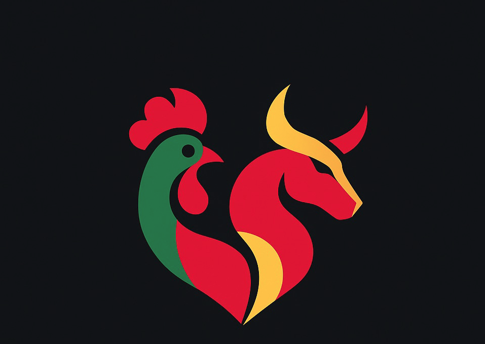

# 🌍 IberiaHub — Iberian Esports & Community Platform



**IberiaHub** is a professional platform connecting the Portuguese and Spanish esports scene.
We start with **Counter-Strike 2** and expand to **EA FC**, **Free Fire**, and **League of Legends**.

🔗 **Live**: https://iberiahub.com

---

## 🚀 Vision
Unite Iberian players, teams and organizations under one ecosystem with:
- Title-specific hubs (CS2, EA FC, Mobile)
- Player ↔ Team **Draft** and visibility
- **News & Media** for the Iberian scene
- **Community spaces** and open lobbies
- **Legal & sponsor** enablement for clubs

> This repo is a **public overview**. Core application code and infrastructure live in private repos.

---

## 🧱 Architecture (high-level)
- **Frontend**: Next.js + React + TailwindCSS
- **Backend**: Node.js (modular services; NestJS/Express depending on module)
- **Database**: PostgreSQL (+ Redis for caching/queues)
- **Infra**: Docker on Contabo VPS; per‑hub deploys
- **Security**: Env‑isolated configs; GDPR‑aware data flows

---

## ✨ Key Modules
- **CS2Hub** — players, teams, news, and Iberian ecosystem focus
- **Teams & Players Profiles** — identity, needs, tags, and recruitment
- **News & Highlights** — curated Iberian esports content
- **Draft (Roadmap)** — connect free agents and active teams
- **Community & Lobby (Roadmap)** — show who is active, not just who is ranked

---

## 🗺️ Roadmap
- ✅ Public website online
- 🔄 CS2Hub: final polish on homepage (hero, hover states, animations)
- 🔜 **Teams** tab with live team profiles and application flows
- 🔜 Player & Team **Profile pages** (`/perfil/jogador/:id`, `/perfil/equipa/:id`)
- 🔜 Draft system (post‑launch phase)
- 🔜 Multi‑language (PT, ES, EN)
- 🔜 Sponsor & legal partner network

---

## 📸 Screenshots
- logo-iberiahub.png: `docs/assets/logo-iberiahub.png`
- hero-image.png: `docs/assets/hero-image.png`
- placeholder-16x9.svg: `docs/assets/placeholder-16x9.svg`
- placeholder-4x3.svg: `docs/assets/placeholder-4x3.svg`

---

## 🧩 Repo Structure (public)
```
iberiahub-public/
├─ frontend/          # placeholder for public-facing assets/modules
├─ backend/           # placeholder for public-facing modules/specs
├─ docs/
│  └─ assets/         # images used by README
├─ .gitignore
├─ LICENSE
└─ README.md
```

> **Note**: This public repo contains **no private app code**. It acts as a **vitrine** to showcase the project, align partners, and accept interest from contributors/sponsors.

---

## 🤝 Get Involved
We are open to:
- Esports **teams** & **leagues** collaborations
- **Sponsors** and media partners
- **Contributors** (design, frontend, backend)

📩 Contact: hello@iberiahub.com

---

## ⚖️ License
**All rights reserved.** This repository is for presentation and community purposes only.

